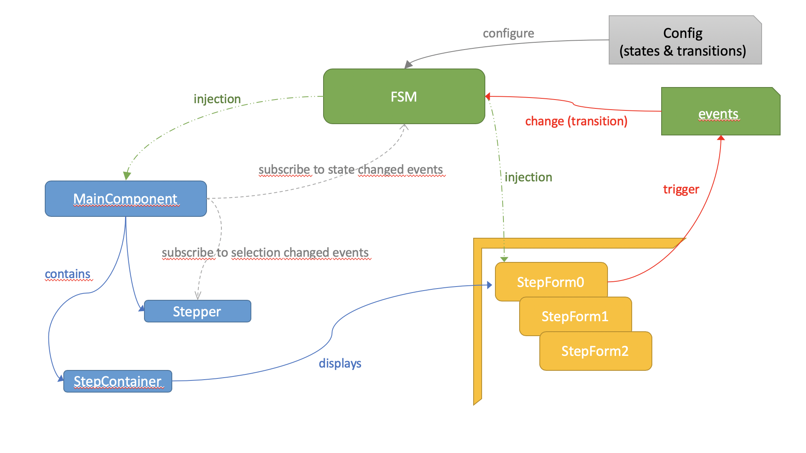

# How it works

In few words :
* Our wizard steps are represented as **states** related by **transitions**. Actually, it's a oriented graph.
* The wizard logic is handled by a **state machine** thanx to [XState](https://xstate.js.org) library.
* A state can be related to a form when we need user inputs.
* Forms send **events** to the state machine in order to trigger transitions.
* The wizard is displayed using a [Angular Material Stepper](https://material.angular.io/components/stepper). This stepper reacts to the FSM state changes, so it's driven by our state machine.

The FSM manages our state machine. It's configuration can be found in `core/fsm.config.ts`.
It's configuration consist of:
* **steps**.
* trigger **events** (that trigger **transitions** between steps).

Some of the states of our FSM are related to a `WizardFormComponent` : in these states, the system is waiting for user inputs.
A wizard form component should only send events to the FSM (to trigger a transition).

The `WizzardMainComponent` is in charge of :
* listening to FSM state change events.
* managing the Stepper.
* displaying the form component in the step container if the current step is related to a form.

Each event sent by the FSM transports a context that is defined in ``ApplicationWizardMachineContext`` ([core/fsm.model.ts](projects/wizard4cloud-ui/src/app/features/application-wizard/core/fsm.model.ts))
We store here data that have a meaning concerning the wizard (it not a _fourre tout_). Usually, user inputs or ids returned by backend (that are both sent through trigger events) are stored in this context.

# How-To update the FSM config

If you need to implement something new in the wizard, you'll probably need to add some states, events, and configure somme transitions in the FSM.

For better understanding of our system, the name of our states should follow the following convention:
* states related to a form have a name terminating by `...Form`.
* states that perfom an invocation should have a name terminating by `...ing`, since thay are do**ing** something.
* transient states that are often the consequence of an action should have a name terminating by `...ed`.

Events follow the following convention:
* events that are triggered by a user (often through a button click) should start with `Do...`.
* events that occur after an invocation should have a name starting by `On...` since they are triggered by an external event. We often have 2 kind of event after an invocation : `On...Sucess` when the invocation result is a success and `On...Error`when it has thrown an error. 

You must have a clear idea of what you need. If not, draw your state chart on a paper or whatever you want. Then :

1. declare your states in ``ApplicationWizardMachineSchema`` ([core/fsm.model.ts](projects/wizard4cloud-ui/src/app/features/application-wizard/core/fsm.model.ts)).
2. add your event classes in [core/fsm.events.ts](projects/wizard4cloud-ui/src/app/features/application-wizard/core/fsm.events.ts).
3. if you need something new in the context add it in ``ApplicationWizardMachineContext`` ([core/fsm.model.ts](projects/wizard4cloud-ui/src/app/features/application-wizard/core/fsm.model.ts)). You'll also need to upate the initial context initialization in the constant ``context`` in [core/fsm.config.ts](projects/wizard4cloud-ui/src/app/features/application-wizard/core/fsm.config.ts).
4. don't forget to declare your new states types in ``ApplicationWizardMachineEvents``.
5. declare your actions and services in ``AppplicationWizardMachineService.machineOptions`` ([core/fsm.service.ts](projects/wizard4cloud-ui/src/app/features/application-wizard/core/fsm.service.ts)).
6. add your states and transition configuration in ``applicationWizardMachineConfig`` ([core/fsm.config.ts](projects/wizard4cloud-ui/src/app/features/application-wizard/core/fsm.config.ts)). 

Once the machine is correctly configured, you'll propably need to add a form in the wizard.

# How-To add a form step in the wizard

A form step is a form component that is related to a given state of the state machine.
Before creating a form step, you must known to which FSM state it is related. 

Then :

1. create a component in the folder 'wizard-forms'
2. make your component implement ``WizardFormComponent`` . You'll then need to define an input of type ``ApplicationWizardMachineContext``. We need this to inject the FSM context when the component will be created.
`@Input() fsmContext: ApplicationWizardMachineContext;`

3. Inject the FSM in the constuctor (you'll need it to send an event to the state machine) :
`constructor(private fsm: AppplicationWizardMachineService) { }`
 
4. declare your component in the ``entryComponents`` of the ``ApplicationWizardModule``.
5. finally declare your form step in ``core/wizard.service.ts``

Remeber that a form step component should only :
* Read values from the fsmContext
* Send events to the state machine.

**That all folks !**
