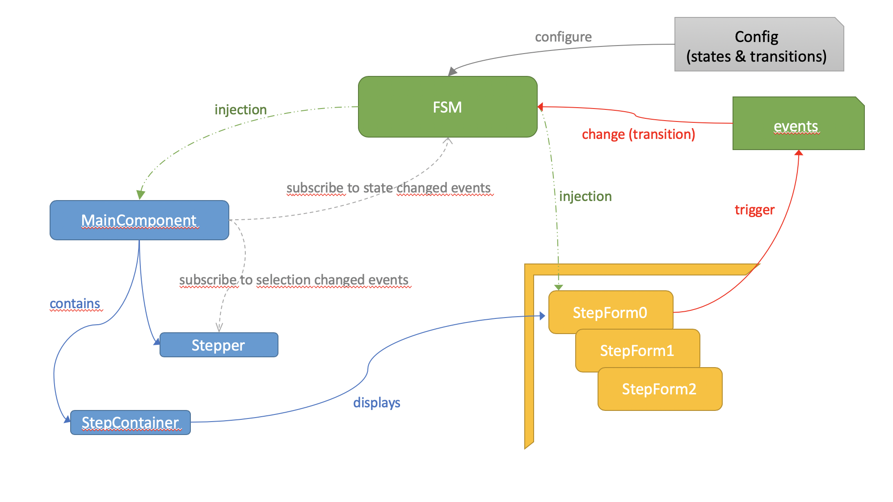

# How it works

# Howto Add a form step in the wizard

A form step is a form component that is related to a given state of the state machine.
Before creating a form step, you must known to which FSM state it is related. 

Then :

* create a component in the folder 'wizard-forms'
* make your component implement ``WizardFormComponent`` . You'll then need to define an input of type ``ApplicationWizardMachineContext``. We need this to inject the FSM context when the component will be created.

`@Input() fsmContext: ApplicationWizardMachineContext;`

* Inject the FSM in the constuctor (you'll need it to send an event to the state machine) :

`constructor(private fsm: AppplicationWizardMachineService) { }`
 
* declare your component in the ``entryComponents`` of the ``ApplicationWizardModule``.
* finally declare your form step in ``core/wizard.service.ts``

Remeber that a form step component should only :
* Read values from the fsmContext
* Send events to the state machine.

**That all folks !**
